# ZAPNINJA - Diagramas Completos do Sistema

## 🎯 Visão Geral

Este documento apresenta os diagramas completos da arquitetura atual do ZAPNINJA e a proposta de modernização com monorepo, Agno Framework e melhorias visuais.

---

## 📊 Arquitetura Atual

### Diagrama da Arquitetura Atual


### Problemas da Arquitetura Atual

```mermaid
mindmap
  root((Problemas Atuais))
    Monolítico
      Acoplamento Alto
      Difícil Escalabilidade
      Deploy Único
      Falha Única
    Código
      Duplicação Types
      Utils Espalhados
      Config Duplicada
      Testes Isolados
    Desenvolvimento
      Build Lento
      Hot Reload Limitado
      Conflitos de Versão
      Deploy Complexo
    Manutenção
      Debugging Difícil
      Logs Misturados
      Métricas Globais
      Rollback Complexo
```



---

## 🚀 Arquitetura Proposta - Monorepo

### Diagrama da Nova Arquitetura
```mermaid
graph TB
    subgraph "ZAPNINJA Monorepo - Arquitetura Moderna"
        subgraph "Clientes"
            WU[WhatsApp Users]
            WEB[Web Dashboard Users]
            MOB[Mobile Users]
            CLI[CLI Admin Users]
            API_CLIENTS[API Clients]
        end
        
        subgraph "Load Balancer & Gateway"
            LB[Load Balancer]
            GW[API Gateway]
        end
        
        subgraph "apps/"
            subgraph "Backend App"
                subgraph "API Layer"
                    REST[REST API Routes]
                    WS[WebSocket Server]
                    AUTH[Auth Middleware]
                    RATE[Rate Limiting]
                end
                
                subgraph "Bot Core"
                    BOT_CORE[Bot Engine]
                    SESSION_MGR[Session Manager]
                    MSG_PROC[Message Processor]
                    CMD_HAND[Command Handler]
                end
                
                subgraph "Workers"
                    MSG_QUEUE[Message Queue Worker]
                    ANALYTICS_W[Analytics Worker]
                    CLEANUP_W[Cleanup Worker]
                    AI_PROC[AI Processing Worker]
                end
            end
            
            subgraph "Web Dashboard"
                subgraph "Next.js App Router"
                    PAGES[Pages & Routes]
                    COMP[Components]
                    HOOKS_WEB[Custom Hooks]
                    API_ROUTES[API Routes]
                end
                
                subgraph "Real-time Features"
                    SOCKET_CLIENT[Socket.io Client]
                    RT_HOOKS[Real-time Hooks]
                    LIVE_UPDATES[Live Updates]
                end
            end
            
            subgraph "Mobile App"
                RN[React Native App]
                MOBILE_API[Mobile API Client]
                PUSH[Push Notifications]
            end
            
            subgraph "Admin CLI"
                CLI_CORE[CLI Core]
                CLI_CMDS[CLI Commands]
                INTERACTIVE[Interactive Mode]
            end
        end
        
        subgraph "packages/"
            subgraph "Shared"
                TYPES[TypeScript Types]
                CONSTANTS[Constants]
                UTILS[Utilities]
                VALIDATORS[Validators]
            end
            
            subgraph "Database"
                DB_CLIENT[Supabase Client]
                QUERIES[Typed Queries]
                SCHEMAS[Zod Schemas]
                MIGRATIONS[SQL Migrations]
            end
            
            subgraph "AI Services"
                subgraph "Providers"
                    OAI_PROVIDER[OpenAI Provider]
                    GEM_PROVIDER[Gemini Provider]
                    AGNO_PROVIDER[Agno Provider]
                end
                
                subgraph "AI Core"
                    CONV_SERVICE[Conversation Service]
                    CTX_SERVICE[Context Service]
                    FALLBACK[Fallback Service]
                end
            end
            
            subgraph "WhatsApp Core"
                WPP_CLIENT[WPP Client Wrapper]
                MSG_HANDLERS[Message Handlers]
                MIDDLEWARE[WhatsApp Middleware]
                WPP_TYPES[WhatsApp Types]
            end
            
            subgraph "UI Components"
                DESIGN_SYS[Design System]
                ATOMS[Atomic Components]
                MOLECULES[Molecule Components]
                ORGANISMS[Organism Components]
                THEMES[Themes & Styles]
            end
        end
        
        subgraph "External Services"
            subgraph "AI Providers"
                OPENAI_EXT[OpenAI GPT-4]
                GEMINI_EXT[Google Gemini]
                AGNO_EXT[Agno Framework]
            end
            
            subgraph "Database & Storage"
                SUPABASE[Supabase PostgreSQL]
                REALTIME[Realtime Subscriptions]
                STORAGE[Supabase Storage]
            end
            
            subgraph "Infrastructure"
                REDIS[Redis Cache]
                QUEUE[Bull Queue]
                METRICS[Metrics Collection]
                LOGS_EXT[Centralized Logging]
            end
        end
        
        subgraph "CI/CD & Deployment"
            subgraph "GitHub Actions"
                CI[CI Pipeline]
                TESTS[Automated Tests]
                BUILD[Build System]
                DEPLOY[Deploy Scripts]
            end
            
            subgraph "Deployment Targets"
                RAILWAY_FULL[Railway - Full Stack]
                DOCKER[Docker Containers]
                K8S[Kubernetes (Future)]
            end
        end
    end
    
    %% Conexões
    WU --> LB
    WEB --> LB
    MOB --> LB
    CLI --> GW
    API_CLIENTS --> GW
    
    LB --> REST
    LB --> WS
    GW --> REST
    
    REST --> AUTH
    AUTH --> RATE
    RATE --> BOT_CORE
    
    BOT_CORE --> SESSION_MGR
    SESSION_MGR --> MSG_PROC
    MSG_PROC --> CMD_HAND
    
    BOT_CORE --> MSG_QUEUE
    MSG_QUEUE --> ANALYTICS_W
    ANALYTICS_W --> CLEANUP_W
    MSG_QUEUE --> AI_PROC
    
    PAGES --> SOCKET_CLIENT
    SOCKET_CLIENT --> WS
    HOOKS_WEB --> RT_HOOKS
    RT_HOOKS --> LIVE_UPDATES
    
    RN --> MOBILE_API
    MOBILE_API --> REST
    
    CLI_CORE --> GW
    CLI_CMDS --> INTERACTIVE
    
    %% Package Dependencies
    REST --> TYPES
    BOT_CORE --> SHARED
    PAGES --> UI Components
    
    SESSION_MGR --> DB_CLIENT
    DB_CLIENT --> QUERIES
    QUERIES --> SCHEMAS
    
    MSG_PROC --> AI Services
    OAI_PROVIDER --> OPENAI_EXT
    GEM_PROVIDER --> GEMINI_EXT
    AGNO_PROVIDER --> AGNO_EXT
    
    BOT_CORE --> WhatsApp Core
    WPP_CLIENT --> MSG_HANDLERS
    
    %% External Connections
    DB_CLIENT --> SUPABASE
    SUPABASE --> REALTIME
    
    MSG_QUEUE --> REDIS
    REDIS --> QUEUE
    
    CI --> TESTS
    TESTS --> BUILD
    BUILD --> DEPLOY
    
    DEPLOY --> RAILWAY_FULL
    DEPLOY --> DOCKER
    
    %% Styling
    classDef app fill:#e3f2fd,stroke:#1976d2,stroke-width:3px
    classDef package fill:#f1f8e9,stroke:#558b2f,stroke-width:2px
    classDef external fill:#fff8e1,stroke:#f57c00,stroke-width:2px
    classDef infra fill:#fce4ec,stroke:#c2185b,stroke-width:2px
    
    class REST,WS,BOT_CORE,PAGES,RN,CLI_CORE app
    class TYPES,DB_CLIENT,AI Services,WhatsApp Core,UI Components package
    class OPENAI_EXT,GEMINI_EXT,AGNO_EXT,SUPABASE external
    class REDIS,QUEUE,CI,VERCEL,RAILWAY infra
```

---

## 🎨 Integração com Agno Framework

### Diagrama de Integração Agno


---

## 🎨 Sistema de UI/UX Modernizado

### Diagrama do Design System


---

## 📊 Fluxo de Dados - Antes vs Depois

### Fluxo Atual (Simplificado)


### Fluxo Proposto (Modernizado)


---

## 🔄 Comparação de Arquiteturas

### Tabela Comparativa

| Aspecto | Arquitetura Atual | Arquitetura Proposta |
|---------|-------------------|---------------------|
| **Estrutura** | Monolítica | Monorepo Modular |
| **Frontend/Backend** | Acoplado | Separado |
| **Deploy** | Único ponto | Independente |
| **Escalabilidade** | Vertical | Horizontal |
| **IA** | OpenAI + Gemini | + Agno Framework |
| **UI/UX** | Básico Shadcn | Magic UI + Shadcn Pro |
| **Real-time** | Limitado | WebSocket completo |
| **Testes** | Manual | Automatizado |
| **CI/CD** | Simples | Pipeline completo |
| **Monitoramento** | Básico | Avançado |

### Métricas de Melhoria Esperadas


---

## 🛣️ Roadmap de Implementação

### Timeline de Migração

```mermaid
gantt
    title Roadmap de Migração ZAPNINJA
    dateFormat  YYYY-MM-DD
    section Fase 1 - Setup
    Estrutura Monorepo    :active, p1, 2025-01-05, 7d
    Configuração Build    :p2, after p1, 5d
    Migração Packages     :p3, after p2, 10d
    
    section Fase 2 - Backend
    Separação API         :p4, after p3, 7d
    Implementação Queue   :p5, after p4, 7d
    Workers Background    :p6, after p5, 5d
    Testes Backend        :p7, after p6, 7d
    
    section Fase 3 - Frontend
    Migração Dashboard    :p8, after p3, 10d
    Magic UI Integration  :p9, after p8, 7d
    WebSocket Setup       :p10, after p9, 5d
    Mobile App Base       :p11, after p10, 14d
    
    section Fase 4 - Agno
    Integração Agno       :p12, after p7, 10d
    Agents Customizados   :p13, after p12, 14d
    Workflow Engine       :p14, after p13, 10d
    
    section Fase 5 - Deploy
    CI/CD Pipeline        :p15, after p14, 7d
    Deploy Staging        :p16, after p15, 5d
    Deploy Produção       :p17, after p16, 3d
    Monitoramento         :p18, after p17, 7d
```


---

## 📋 Checklist de Implementação

### ✅ Checklist Técnico

#### Fase 1 - Setup Monorepo
- [ ] Criar estrutura de pastas
- [ ] Configurar Turborepo
- [ ] Setup TypeScript configs
- [ ] Configurar ESLint/Prettier
- [ ] Criar packages básicos

#### Fase 2 - Migração Backend
- [ ] Extrair API REST
- [ ] Implementar Message Queue
- [ ] Configurar Workers
- [ ] Setup WebSocket server
- [ ] Migrar services existentes

#### Fase 3 - Migração Frontend
- [ ] Migrar Next.js app
- [ ] Implementar Design System
- [ ] Integrar Magic UI
- [ ] Setup real-time hooks
- [ ] Configurar responsive design

#### Fase 4 - Integração Agno
- [ ] Setup Agno Framework
- [ ] Criar agents customizados
- [ ] Implementar workflow engine
- [ ] Configurar multi-agent system
- [ ] Integrar com WhatsApp core

#### Fase 5 - Deploy & Monitoramento
- [ ] Configurar CI/CD
- [ ] Setup staging environment
- [ ] Deploy produção
- [ ] Configurar monitoramento
- [ ] Setup alertas

### 🎯 Checklist de Qualidade

#### Performance
- [ ] Bundle size otimizado
- [ ] Lazy loading implementado
- [ ] Cache strategies definidas
- [ ] CDN configurado
- [ ] Métricas de performance

#### Acessibilidade
- [ ] WCAG 2.1 AA compliance
- [ ] Keyboard navigation
- [ ] Screen reader support
- [ ] Focus indicators
- [ ] Alt text para imagens

#### SEO & Meta
- [ ] Meta tags otimizadas
- [ ] Open Graph tags
- [ ] Sitemap gerado
- [ ] Robot.txt configurado
- [ ] Structured data

#### Segurança
- [ ] Auth/Authorization
- [ ] Input validation
- [ ] CORS configurado
- [ ] Rate limiting
- [ ] Security headers

---

*Diagramas completos do sistema ZAPNINJA*  
*Versão: 1.0 | Data: 2025-01-05*