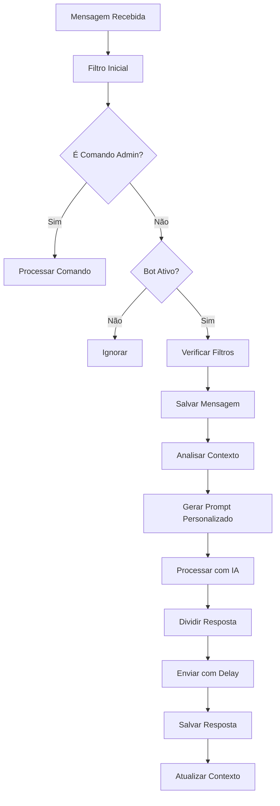

# ZAPNINJA - Especificações Técnicas

## Visão Geral do Sistema

O **ZAPNINJA** é um sistema avançado de chatbot para WhatsApp com memória persistente e inteligência artificial integrada. O sistema permite múltiplas sessões simultâneas, gerenciamento administrativo completo e análise inteligente de contexto conversacional.

### Características Principais

- **Multi-Sessão**: Suporte a múltiplas instâncias simultâneas do WhatsApp
- **IA Dual**: Integração com OpenAI GPT e Google Gemini
- **Memória Persistente**: Sistema de contexto inteligente com banco de dados PostgreSQL
- **Administração Avançada**: 35+ comandos administrativos via WhatsApp
- **Escalabilidade**: Arquitetura preparada para alta disponibilidade

## Arquitetura do Sistema

### Stack Tecnológico

```yaml
Runtime: Node.js 18+
Linguagem: TypeScript
Framework Principal: Express.js
Automação WhatsApp: @wppconnect-team/wppconnect
Banco de Dados: PostgreSQL (Supabase)
Serviços IA:
  - OpenAI GPT-4 (Assistants API)
  - Google Gemini Pro
Build System: tsup
Process Manager: tsx (development)
```

### Dependências Principais

```json
{
  "dependencies": {
    "@google/generative-ai": "^0.21.0",
    "@supabase/supabase-js": "^2.56.1",
    "@wppconnect-team/wppconnect": "^1.35.1",
    "openai": "^4.67.3",
    "express": "^4.21.2",
    "axios": "^1.7.7",
    "dotenv": "^16.6.1"
  }
}
```

## Componentes Principais

### 1. Sistema de Entrada (`src/index.ts`)

**Responsabilidades:**
- Gerenciamento de múltiplas sessões WhatsApp
- Servidor HTTP para monitoramento
- Processamento de comandos administrativos
- Controle de fluxo de mensagens

**Parâmetros de CLI:**
```bash
npm run dev -- --session=sessionName --port=3001 --ai=GPT
```

### 2. Serviços de IA

#### OpenAI Service (`src/service/openai.ts`)
```typescript
- Integração com OpenAI Assistants API
- Gerenciamento de threads de conversação
- Configuração dinâmica de modelos
```

#### Google Service (`src/service/google.ts`)
```typescript
- Google Generative AI integration
- Context-aware conversation handling
- Fallback para problemas de conectividade
```

### 3. Camada de Dados

#### Database Service (`src/services/database.service.ts`)
```typescript
interface DatabaseOperations {
  // Sessões
  getSession(sessionName: string): Promise<Session>
  createSession(sessionData): Promise<Session>
  
  // Usuários
  getOrCreateUser(phoneNumber: string): Promise<User>
  updateUserProfile(userId: string, profile: UserProfile): Promise<void>
  
  // Mensagens
  saveMessage(conversationId: string, message: Message): Promise<void>
  getConversationHistory(userId: string, limit?: number): Promise<Message[]>
  
  // Contexto
  saveUserContext(userId: string, context: UserContext): Promise<void>
  getUserContext(userId: string): Promise<UserContext[]>
}
```

### 4. Motor de Contexto (`src/services/context-engine.service.ts`)

**Funcionalidades Avançadas:**
```typescript
interface ContextEngine {
  analyzeMessage(message: string, userId: string): Promise<MessageAnalysis>
  getUserProfile(userId: string): Promise<UserProfile>
  generatePersonalizedPrompt(userId: string, message: string): Promise<string>
  updateConversationContext(userId: string, context: Context): Promise<void>
}

interface MessageAnalysis {
  sentiment: 'positive' | 'negative' | 'neutral'
  intent: string
  entities: ExtractedEntity[]
  topics: string[]
  urgency: 'low' | 'medium' | 'high'
}
```

### 5. Sistema de Comandos Administrativos

#### Admin Commands Service (`src/services/admin-commands.service.ts`)

**Categorias de Comandos:**

```yaml
Gestão de Sessões:
  - !listar_sessoes: Lista todas as sessões ativas
  - !criar_sessao <nome>: Cria nova sessão
  - !ativar_sessao <nome>: Ativa sessão específica
  - !desativar_sessao <nome>: Desativa sessão

Gestão de Usuários:
  - !listar_usuarios: Lista usuários ativos
  - !bloquear_usuario <número>: Bloqueia usuário
  - !info_usuario <número>: Informações detalhadas
  - !limpar_contexto <número>: Reset do contexto

Configuração de IA:
  - !config_ia: Configurações da IA
  - !modelo_ia <gpt|gemini>: Troca modelo
  - !temperatura <0.1-2.0>: Ajusta criatividade
  - !prompt_sistema <prompt>: Prompt global
  - !prompt_sessao <sessão> <prompt>: Prompt específico

Controle de Timing:
  - !config_timing: Assistente de configuração
  - !tempo_resposta <ms>: Delay base
  - !horario_funcionamento <início> <fim>: Horário ativo
  - !limite_mensagens <número>: Rate limiting

Monitoramento:
  - !metricas: Estatísticas do sistema
  - !performance: Métricas de performance
  - !logs: Últimos logs do sistema
  - !historico: Histórico de interações

Manutenção:
  - !backup: Backup do banco
  - !limpeza: Limpeza de dados antigos
  - !teste_conexao: Testa conectividade
```

### 6. Gerenciador de Sessões (`src/services/session.manager.ts`)

**Funcionalidades:**
```typescript
class SessionManager {
  // Cria ou recupera sessão existente
  async getOrCreateSession(sessionName: string): Promise<Session>
  
  // Registra usuário automaticamente
  async registerUser(phoneNumber: string, userData: any): Promise<User>
  
  // Salva mensagem com contexto
  async saveMessage(userId: string, sessionName: string, content: string, type: MessageType, metadata?: any): Promise<void>
  
  // Recupera histórico inteligente
  async getConversationHistory(userId: string, sessionName: string, limit: number = 10): Promise<Message[]>
  
  // Gerencia contexto da conversa
  async updateConversationContext(userId: string, sessionName: string, context: any): Promise<void>
}
```

## Esquema do Banco de Dados (Supabase)

### Tabelas Principais

#### 1. whatsapp_sessions
```sql
CREATE TABLE whatsapp_sessions (
  id UUID PRIMARY KEY DEFAULT gen_random_uuid(),
  session_name VARCHAR(100) UNIQUE NOT NULL,
  phone_number VARCHAR(20),
  is_active BOOLEAN DEFAULT true,
  ai_config JSONB DEFAULT '{}',
  timing_config JSONB DEFAULT '{}',
  custom_prompt TEXT,
  max_messages INTEGER DEFAULT 100,
  created_at TIMESTAMP WITH TIME ZONE DEFAULT NOW(),
  updated_at TIMESTAMP WITH TIME ZONE DEFAULT NOW()
);
```

#### 2. whatsapp_users
```sql
CREATE TABLE whatsapp_users (
  id UUID PRIMARY KEY DEFAULT gen_random_uuid(),
  phone_number VARCHAR(20) UNIQUE NOT NULL,
  name VARCHAR(255),
  display_name VARCHAR(255),
  profile_data JSONB DEFAULT '{}',
  preferences JSONB DEFAULT '{}',
  created_at TIMESTAMP WITH TIME ZONE DEFAULT NOW(),
  updated_at TIMESTAMP WITH TIME ZONE DEFAULT NOW()
);
```

#### 3. conversations
```sql
CREATE TABLE conversations (
  id UUID PRIMARY KEY DEFAULT gen_random_uuid(),
  session_id UUID NOT NULL REFERENCES whatsapp_sessions(id) ON DELETE CASCADE,
  user_id UUID NOT NULL REFERENCES whatsapp_users(id) ON DELETE CASCADE,
  conversation_data JSONB DEFAULT '{}',
  context_summary TEXT,
  last_interaction TIMESTAMP WITH TIME ZONE DEFAULT NOW(),
  created_at TIMESTAMP WITH TIME ZONE DEFAULT NOW(),
  updated_at TIMESTAMP WITH TIME ZONE DEFAULT NOW(),
  UNIQUE(session_id, user_id)
);
```

#### 4. messages
```sql
CREATE TABLE messages (
  id UUID PRIMARY KEY DEFAULT gen_random_uuid(),
  conversation_id UUID NOT NULL REFERENCES conversations(id) ON DELETE CASCADE,
  sender_type VARCHAR(20) NOT NULL CHECK (sender_type IN ('user', 'ai', 'system')),
  content TEXT NOT NULL,
  message_type VARCHAR(20) DEFAULT 'text' CHECK (message_type IN ('text', 'image', 'audio', 'document', 'command')),
  metadata JSONB DEFAULT '{}',
  created_at TIMESTAMP WITH TIME ZONE DEFAULT NOW()
);
```

#### 5. user_context
```sql
CREATE TABLE user_context (
  id UUID PRIMARY KEY DEFAULT gen_random_uuid(),
  user_id UUID NOT NULL REFERENCES whatsapp_users(id) ON DELETE CASCADE,
  session_id UUID NOT NULL REFERENCES whatsapp_sessions(id) ON DELETE CASCADE,
  context_type VARCHAR(50) NOT NULL,
  context_data JSONB NOT NULL,
  relevance_score DECIMAL(3,2) DEFAULT 1.0 CHECK (relevance_score >= 0 AND relevance_score <= 1),
  expires_at TIMESTAMP WITH TIME ZONE,
  created_at TIMESTAMP WITH TIME ZONE DEFAULT NOW(),
  updated_at TIMESTAMP WITH TIME ZONE DEFAULT NOW()
);
```

## Fluxo de Processamento de Mensagens

### Pipeline Completo



### Algoritmo de Timing Inteligente

```typescript
interface TimingConfig {
  minReadingTime: number;        // Tempo mínimo de leitura (2000ms)
  readingTimePerChar: number;    // Tempo por caractere (50ms)
  minThinkingTime: number;       // Tempo mínimo de reflexão (1000ms)
  maxThinkingTime: number;       // Tempo máximo de reflexão (5000ms)
  longBreakChance: number;       // Chance de pausa longa (0.05)
  longBreakMinTime: number;      // Min pausa longa (5000ms)
  longBreakMaxTime: number;      // Max pausa longa (15000ms)
}

function calculateResponseDelay(messageLength: number): DelayInfo {
  const readingTime = Math.max(
    config.minReadingTime, 
    messageLength * config.readingTimePerChar
  );
  
  const thinkingTime = Math.random() * 
    (config.maxThinkingTime - config.minThinkingTime) + 
    config.minThinkingTime;
    
  const hasLongBreak = Math.random() < config.longBreakChance;
  const longBreak = hasLongBreak ? 
    Math.random() * (config.longBreakMaxTime - config.longBreakMinTime) + 
    config.longBreakMinTime : 0;
    
  return {
    delay: readingTime + thinkingTime + longBreak,
    description: `Lendo (${readingTime}ms) + Pensando (${thinkingTime}ms)${hasLongBreak ? ` + Pausa (${longBreak}ms)` : ''}`
  };
}
```

## Sistema de Análise de Contexto

### Extração de Entidades

```typescript
interface EntityExtraction {
  extractEmails(text: string): string[]
  extractPhoneNumbers(text: string): string[]
  extractCPF(text: string): string[]
  extractCNPJ(text: string): string[]
  extractMoneyValues(text: string): number[]
  extractDates(text: string): Date[]
  extractUrls(text: string): string[]
}
```

### Análise de Sentimento

```typescript
interface SentimentAnalysis {
  positive: string[]  // Palavras positivas
  negative: string[]  // Palavras negativas
  neutral: string[]   // Palavras neutras
  
  analyze(text: string): {
    sentiment: 'positive' | 'negative' | 'neutral'
    confidence: number
    keywords: string[]
  }
}
```

### Detecção de Intenção

```typescript
const intentPatterns = {
  greeting: /^(oi|olá|hey|oie|eai)/i,
  question: /\?|como|quando|onde|por que|qual/i,
  complaint: /problema|erro|não funciona|ruim/i,
  compliment: /obrigado|valeu|parabéns|ótimo/i,
  goodbye: /tchau|até logo|bye|falou/i,
  request: /pode|consegue|me ajuda|preciso/i
};
```

## Configurações Avançadas

### Variáveis de Ambiente

```env
# Configurações Básicas
NODE_ENV=development
PORT=3000
SESSION_NAME=sessionName

# IA Configuration
AI_SELECTED=GEMINI
OPENAI_KEY=sk-...
OPENAI_ASSISTANT=asst_...
GEMINI_KEY=AIza...

# Supabase
SUPABASE_URL=https://...
SUPABASE_ANON_KEY=eyJ...
SUPABASE_SERVICE_ROLE_KEY=eyJ...

# Bot Control
BOT_ACTIVE=true
ADMIN_NUMBERS=5511999999999,5511888888888

# Timing Configuration
MIN_READING_TIME=2000
READING_TIME_PER_CHAR=50
MIN_THINKING_TIME=1000
MAX_THINKING_TIME=5000
LONG_BREAK_CHANCE=0.05
LONG_BREAK_MIN_TIME=5000
LONG_BREAK_MAX_TIME=15000

# Commands
PAUSE_COMMAND=!pausar
RESUME_COMMAND=!retomar
STATUS_COMMAND=!status
HELP_COMMAND=!ajuda
```

## Monitoramento e Logging

### Endpoints de Monitoramento

```typescript
// Health Check Endpoint
GET /health
Response: {
  name: string,
  port: number,
  status: 'initializing' | 'running' | 'error',
  connected: boolean,
  lastActivity: Date,
  messagesProcessed: number,
  errors: number,
  uptime: number
}

// Status Endpoint
GET /status
Response: SessionStatus

// Shutdown Endpoint
POST /shutdown
Response: { message: 'Shutdown initiated' }
```

### Sistema de Logs Estruturados

```typescript
interface LogEntry {
  timestamp: string;
  level: 'info' | 'warn' | 'error' | 'debug';
  message: string;
  metadata?: any;
  sessionName?: string;
  userId?: string;
}

// Tipos de Log Específicos
logger.messageReceived(userId: string, content: string)
logger.messageSent(userId: string, content: string)
logger.commandExecuted(command: string, userId: string, success: boolean)
logger.aiResponse(model: string, responseTime: number)
logger.connectionStatus(status: 'connected' | 'disconnected')
```

## Segurança e Controle de Acesso

### Sistema de Autorização

```typescript
// Verificação de Admin
function isAdmin(phoneNumber: string): boolean {
  return ADMIN_NUMBERS.some(adminNum => 
    phoneNumber.includes(adminNum.replace(/\D/g, ''))
  );
}

// Controle de Rate Limiting
interface RateLimit {
  maxMessagesPerHour: number;
  maxMessagesPerDay: number;
  cooldownPeriod: number;
}

// Filtro de Contatos
interface ContactFilter {
  mode: 'whitelist' | 'blacklist' | 'all';
  numbers: string[];
  shouldProcessMessage(phoneNumber: string): boolean;
}
```

### Validação de Entrada

```typescript
interface MessageValidation {
  maxLength: number;
  allowedTypes: MessageType[];
  contentFilters: string[];
  
  validate(message: Message): ValidationResult;
}
```

## Performance e Escalabilidade

### Estratégias de Cache

```typescript
// Cache em Memória
const messageBufferPerChatId = new Map<string, string[]>();
const messageTimeouts = new Map<string, NodeJS.Timeout>();

// Cache de Contexto
const contextCache = new Map<string, UserContext>();

// Cache de Sessões
const sessionCache = new Map<string, Session>();
```

### Otimizações de Banco

```sql
-- Índices Essenciais
CREATE INDEX CONCURRENTLY idx_messages_conversation_created 
ON messages(conversation_id, created_at DESC);

CREATE INDEX CONCURRENTLY idx_user_context_user_session 
ON user_context(user_id, session_id);

CREATE INDEX CONCURRENTLY idx_conversations_session_user 
ON conversations(session_id, user_id);
```

### Métricas de Performance

```typescript
interface PerformanceMetrics {
  avgResponseTime: number;
  messagesPerSecond: number;
  activeUsers: number;
  activeSessions: number;
  memoryUsage: number;
  cpuUsage: number;
  databaseConnections: number;
  errorRate: number;
}
```

## Deploy e Operação

### Scripts de Deploy

```json
{
  "scripts": {
    "config": "node ./setup.js",
    "dev": "tsx watch src/index.ts",
    "build": "tsup src",
    "start": "npm run build && node dist/index.cjs",
    "session": "npm run build && node dist/index.cjs"
  }
}
```

### Estrutura de Processos

```bash
# Processo Master (Orquestrador)
npm run start

# Processo de Sessão Específica
npm run start -- --session=sessionName --port=3001

# Processo de Monitoramento
npm run start -- --session=monitor --port=3002
```

### Health Checks e Monitoring

```typescript
// Health Check Script
const healthCheck = {
  database: () => testSupabaseConnection(),
  whatsapp: () => client.getConnectionState(),
  ai: () => testAIConnection(),
  memory: () => process.memoryUsage(),
  uptime: () => process.uptime()
};
```

## Troubleshooting e Manutenção

### Comandos de Diagnóstico

```bash
# Verificar logs
tail -f logs/bot-$(date +%Y-%m-%d).log

# Health check manual
curl http://localhost:3000/health

# Teste de conectividade
npm run test:connection

# Limpeza de cache
npm run cleanup
```

### Problemas Comuns

1. **Conexão WhatsApp perdida**: Verificar QR code e reautenticar
2. **Erro de IA**: Verificar keys e quotas das APIs
3. **Banco desconectado**: Verificar configurações Supabase
4. **Alto uso de memória**: Executar limpeza de cache
5. **Rate limit**: Ajustar configurações de timing

---

*Documentação gerada automaticamente pelo sistema ZAPNINJA*
*Versão: 2.1 - Data: $(date)*