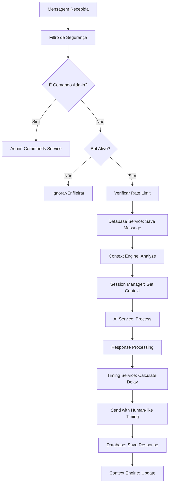

# ZAPNINJA - Documentação Técnica Completa

## 🎯 Visão Geral do Sistema

O **ZAPNINJA** é um sistema avançado de chatbot inteligente para WhatsApp com memória persistente, múltiplas sessões simultâneas e interface web de gerenciamento. O sistema integra Inteligência Artificial (OpenAI GPT e Google Gemini), banco de dados PostgreSQL (Supabase) e uma arquitetura escalável baseada em Node.js/TypeScript.

### Características Principais

- **🔄 Multi-Sessão**: Suporte a múltiplas instâncias WhatsApp simultâneas
- **🧠 IA Dual**: Integração OpenAI GPT-4 + Google Gemini
- **💾 Memória Persistente**: Sistema de contexto inteligente com PostgreSQL
- **⚙️ Dashboard Web**: Interface Next.js para gerenciamento completo
- **🎮 Terminal Dashboard**: Interface CLI interativa para controle
- **🛠️ 35+ Comandos Admin**: Gerenciamento via WhatsApp
- **📊 Métricas Avançadas**: Monitoramento e analytics em tempo real
- **🔧 Auto-Scaling**: Arquitetura preparada para alta disponibilidade

---

## 🏗️ Arquitetura do Sistema

### Stack Tecnológico Completo

```yaml
Backend:
  Runtime: Node.js 18+
  Linguagem: TypeScript
  Automação WhatsApp: "@wppconnect-team/wppconnect"
  Build: tsup
  Process Manager: tsx (dev)
  Platform: Railway

Frontend Dashboard:
  Framework: Next.js 15
  UI Library: Shadcn/UI + Tailwind CSS + Magic UI
  Estado: React Hooks + Context
  Icons: Lucide React
  Platform: Railway

Banco de Dados:
  Database: PostgreSQL (Railway)
  ORM: pg + Redis
  Schema: 8 tabelas principais + índices otimizados

Serviços IA:
  OpenAI: GPT-4 (Assistants API)
  Google: Gemini Pro
  Agno Framework: Multi-Agent System
  Fallback: Sistema de redundância

Infraestrutura:
  HTTP Server: Express.js
  Real-time: WebSocket + Socket.io
  Cache: Redis (Railway)
  Logging: Winston + Custom Logger
  Monitoring: Health checks + Metrics
  Platform: Railway Full Stack
```

### Componentes da Arquitetura

#### 1. Core System (`src/`)
```
src/
├── main.ts                 # Entry point principal
├── index.ts               # Legacy entry point 
├── config/
│   └── supabase.ts        # Configuração Supabase + Types
├── dashboard/             # Sistema de dashboard CLI
│   ├── main-launcher.ts   # Launcher principal
│   ├── terminal-dashboard.ts
│   ├── session-controller.ts
│   └── port-manager.ts
├── services/              # Serviços core
│   ├── database.service.ts
│   ├── session.manager.ts
│   ├── admin-commands.service.ts
│   ├── context-engine.service.ts
│   └── timing.service.ts
├── service/               # Integração IA
│   ├── openai.ts
│   └── google.ts
└── util/                  # Utilitários
    ├── logger.ts
    ├── config.ts
    ├── timingConfig.ts
    └── maintenance.ts
```

#### 2. Frontend Dashboard (`zapninja-dashboard/`)
```
zapninja-dashboard/
├── src/
│   ├── app/               # Next.js App Router
│   │   ├── page.tsx       # Dashboard principal
│   │   ├── instances/     # Gestão de instâncias
│   │   ├── conversations/ # Visualização de conversas
│   │   ├── contacts/      # Gestão de contatos
│   │   ├── metrics/       # Métricas e analytics
│   │   ├── reports/       # Relatórios
│   │   ├── ai-prompts/    # Gestão de prompts IA
│   │   └── settings/      # Configurações
│   ├── components/
│   │   ├── ui/            # Shadcn/UI components
│   │   ├── app-sidebar.tsx
│   │   ├── create-session-modal.tsx
│   │   └── qr-code-modal.tsx
│   ├── hooks/             # React Hooks customizados
│   │   ├── use-realtime.ts
│   │   └── use-mobile.ts
│   └── lib/               # Utilitários
│       ├── supabase.ts
│       └── utils.ts
├── components.json        # Configuração Shadcn
├── next.config.ts
├── tailwind.config.ts
└── tsconfig.json
```

---

## 🗄️ Esquema do Banco de Dados

### Estrutura Principal (8 Tabelas)

#### 1. whatsapp_sessions - Gestão de Sessões
```sql
CREATE TABLE whatsapp_sessions (
  id UUID PRIMARY KEY DEFAULT gen_random_uuid(),
  session_name VARCHAR(100) UNIQUE NOT NULL,
  phone_number VARCHAR(20),
  is_active BOOLEAN DEFAULT true,
  ai_config JSONB DEFAULT '{}',           -- Configurações da IA
  timing_config JSONB DEFAULT '{}',       -- Timing avançado
  custom_prompt TEXT,                     -- Prompt personalizado
  max_messages INTEGER DEFAULT 100,
  created_at TIMESTAMP WITH TIME ZONE DEFAULT NOW(),
  updated_at TIMESTAMP WITH TIME ZONE DEFAULT NOW()
);
```

#### 2. whatsapp_users - Gestão de Usuários
```sql
CREATE TABLE whatsapp_users (
  id UUID PRIMARY KEY DEFAULT gen_random_uuid(),
  phone_number VARCHAR(20) UNIQUE NOT NULL,
  name VARCHAR(255),
  display_name VARCHAR(255),              -- NOVO: Nome de exibição
  is_active BOOLEAN DEFAULT true,         -- NOVO: Status do usuário
  profile_data JSONB DEFAULT '{}',
  preferences JSONB DEFAULT '{}',
  created_at TIMESTAMP WITH TIME ZONE DEFAULT NOW(),
  updated_at TIMESTAMP WITH TIME ZONE DEFAULT NOW()
);
```

#### 3. conversations - Conversas Contextualizadas
```sql
CREATE TABLE conversations (
  id UUID PRIMARY KEY DEFAULT gen_random_uuid(),
  session_id UUID NOT NULL REFERENCES whatsapp_sessions(id) ON DELETE CASCADE,
  user_id UUID NOT NULL REFERENCES whatsapp_users(id) ON DELETE CASCADE,
  conversation_data JSONB DEFAULT '{}',
  context_summary TEXT,
  last_interaction TIMESTAMP WITH TIME ZONE DEFAULT NOW(),
  created_at TIMESTAMP WITH TIME ZONE DEFAULT NOW(),
  updated_at TIMESTAMP WITH TIME ZONE DEFAULT NOW(),
  UNIQUE(session_id, user_id)
);
```

#### 4. messages - Mensagens com Metadata
```sql
CREATE TABLE messages (
  id UUID PRIMARY KEY DEFAULT gen_random_uuid(),
  conversation_id UUID NOT NULL REFERENCES conversations(id) ON DELETE CASCADE,
  sender_type VARCHAR(20) NOT NULL CHECK (sender_type IN ('user', 'ai', 'system')),
  content TEXT NOT NULL,
  message_type VARCHAR(20) DEFAULT 'text' CHECK (message_type IN ('text', 'image', 'audio', 'document', 'command')),
  metadata JSONB DEFAULT '{}',
  created_at TIMESTAMP WITH TIME ZONE DEFAULT NOW()
);
```

#### 5. user_context - Contexto Inteligente
```sql
CREATE TABLE user_context (
  id UUID PRIMARY KEY DEFAULT gen_random_uuid(),
  user_id UUID NOT NULL REFERENCES whatsapp_users(id) ON DELETE CASCADE,
  session_id UUID NOT NULL REFERENCES whatsapp_sessions(id) ON DELETE CASCADE,
  context_type VARCHAR(50) NOT NULL,
  context_data JSONB NOT NULL,
  relevance_score DECIMAL(3,2) DEFAULT 1.0,
  expires_at TIMESTAMP WITH TIME ZONE,
  created_at TIMESTAMP WITH TIME ZONE DEFAULT NOW(),
  updated_at TIMESTAMP WITH TIME ZONE DEFAULT NOW(),
  UNIQUE(user_id, session_id, context_type)
);
```

#### 6-8. Tabelas de Sistema
- **admin_commands**: Log de comandos administrativos
- **system_metrics**: Métricas do sistema
- **learning_data**: Dados de aprendizado da IA

### Otimizações de Performance

#### Índices Essenciais
```sql
-- Índices para consultas frequentes
CREATE INDEX CONCURRENTLY idx_messages_conversation_created 
  ON messages(conversation_id, created_at DESC);

CREATE INDEX CONCURRENTLY idx_user_context_user_session 
  ON user_context(user_id, session_id);

CREATE INDEX CONCURRENTLY idx_conversations_session_user 
  ON conversations(session_id, user_id);

-- Índices para busca
CREATE INDEX CONCURRENTLY idx_whatsapp_users_phone 
  ON whatsapp_users(phone_number);

CREATE INDEX CONCURRENTLY idx_sessions_active 
  ON whatsapp_sessions(is_active);
```

---

## 🎮 Sistema de Dashboard

### Terminal Dashboard Interativo

O sistema possui um dashboard terminal avançado com as seguintes funcionalidades:

```typescript
interface DashboardFeatures {
  sessionManagement: {
    createSession: (name: string) => Promise<void>;
    startSession: (name: string) => Promise<void>;
    stopSession: (name: string) => Promise<void>;
    listSessions: () => Promise<Session[]>;
  };
  
  monitoring: {
    realTimeMetrics: boolean;
    healthChecks: boolean;
    logViewer: boolean;
    performanceAnalytics: boolean;
  };

  configuration: {
    aiModelSelection: 'GPT' | 'GEMINI';
    timingConfiguration: TimingConfig;
    promptManagement: boolean;
    portManagement: boolean;
  };
}
```

### Web Dashboard (Next.js)

Interface moderna com:
- **Dashboard Principal**: Métricas em tempo real
- **Gestão de Instâncias**: CRUD completo de sessões
- **Visualização de Conversas**: Chat interface
- **Gestão de Contatos**: CRM básico
- **Métricas Avançadas**: Analytics e relatórios
- **Configurações**: IA, timing, prompts

---

## 🤖 Sistema de IA Dual

### OpenAI GPT Integration (`src/service/openai.ts`)

```typescript
interface OpenAIService {
  // Assistants API
  createAssistant(config: AssistantConfig): Promise<Assistant>;
  createThread(): Promise<Thread>;
  sendMessage(threadId: string, content: string): Promise<Message>;
  processRun(threadId: string, assistantId: string): Promise<RunResult>;
  
  // Context Management
  maintainContext(userId: string, sessionId: string): Promise<void>;
  
  // Advanced Features
  fileUploads: boolean;
  functionCalling: boolean;
  codeInterpreter: boolean;
}
```

### Google Gemini Integration (`src/service/google.ts`)

```typescript
interface GoogleService {
  // Gemini Pro
  generateContent(prompt: string, context?: string): Promise<GenerativeResponse>;
  streamGenerateContent(prompt: string): AsyncGenerator<string>;
  
  // Vision API
  analyzeImage(imageData: Buffer, prompt?: string): Promise<AnalysisResult>;
  
  // Safety Settings
  configureSafety(settings: SafetySettings): void;
}
```

### Fallback e Load Balancing

O sistema implementa failover automático:
1. **Tentativa Primária**: Modelo configurado
2. **Fallback**: Modelo alternativo
3. **Rate Limiting**: Controle de quota
4. **Error Recovery**: Retry logic inteligente

---

## 🛠️ Sistema de Comandos Administrativos

### 35+ Comandos Disponíveis

#### Gestão de Sessões
```bash
!listar_sessoes              # Lista sessões ativas
!criar_sessao <nome>         # Cria nova sessão
!ativar_sessao <nome>        # Ativa sessão
!desativar_sessao <nome>     # Desativa sessão
!config_sessao <nome>        # Configura sessão
```

#### Gestão de Usuários  
```bash
!listar_usuarios             # Lista usuários ativos
!info_usuario <telefone>     # Detalhes do usuário
!bloquear_usuario <telefone> # Bloqueia usuário
!limpar_contexto <telefone>  # Reset contexto
```

#### Configuração de IA
```bash
!config_ia                   # Wizard de configuração
!modelo_ia <gpt|gemini>      # Troca modelo
!temperatura <0.1-2.0>       # Ajusta criatividade
!prompt_sistema <prompt>     # Prompt global
!prompt_sessao <sessão> <prompt> # Prompt específico
!ver_prompt <sessão>         # Visualiza prompt
```

#### Sistema de Timing Avançado
```bash
!tempo_resposta <ms>         # Delay antes de responder
!delay_mensagem <ms>         # Pausa entre mensagens  
!tempo_descanso <ms>         # Pausas periódicas
!horario_funcionamento <inicio> <fim> # Horário ativo
!limite_mensagens <numero>   # Rate limiting
!config_timing              # Wizard completo
```

#### Monitoramento
```bash
!metricas                    # Estatísticas sistema
!performance                 # Análise performance
!logs                        # Logs do sistema
!historico                   # Histórico interações
!status                      # Status atual
```

#### Manutenção
```bash
!backup                      # Backup banco
!limpeza                     # Limpeza dados antigos
!teste_conexao              # Testa conectividade
!reiniciar                   # Reinicia sessão
```

### Timing System Avançado

```typescript
interface AdvancedTiming {
  responseTime: number;           // Delay antes resposta (500-30000ms)
  messageDelay: number;           // Pausa entre mensagens (0-10000ms)
  restPeriod: number;             // Pausas periódicas (0-60000ms)
  workingHours: {                 // Horário funcionamento
    start: string;                // Ex: "08:00"
    end: string;                  // Ex: "18:00"  
  };
  messageLimit: number;           // Limite msgs/hora (0-1000)
  typingSimulation: boolean;      // Simula digitação
  longBreakChance: number;        // Chance pausa longa (0-1)
  humanBehaviorProfile: string;   // "empresarial" | "casual" | "rapido"
}
```

---

## 📊 Sistema de Métricas e Monitoramento

### Health Checks Automáticos

```typescript
interface HealthCheck {
  database: ConnectionStatus;
  whatsapp: ConnectionStatus;
  aiServices: {
    openai: ServiceStatus;
    gemini: ServiceStatus;
  };
  system: {
    memory: MemoryUsage;
    cpu: CPUUsage;
    uptime: number;
  };
  sessions: SessionHealth[];
}
```

### Endpoints de Monitoramento

```typescript
// Health Check
GET /health
Response: {
  name: string,
  port: number,
  status: 'initializing' | 'running' | 'error',
  connected: boolean,
  lastActivity: Date,
  messagesProcessed: number,
  errors: number,
  uptime: number
}

// Status Detalhado
GET /status
Response: SessionStatus

// Shutdown Graceful
POST /shutdown
```

### Real-time Analytics

O dashboard web fornece:
- **Taxa de Atividade**: % sessões ativas
- **Mensagens por Conversa**: Média engagement
- **Conversas por Usuário**: Retenção
- **Performance IA**: Tempo resposta médio
- **Erros e Alertas**: Monitoramento proativo

---

## 🚀 Deployment e Operação

### Scripts de Execução

```json
{
  "scripts": {
    "config": "node ./setup.js",
    "dev": "tsx src/main.ts",
    "dev:dashboard": "tsx src/main.ts -- --dashboard", 
    "dev:legacy": "tsx src/index.ts",
    "build": "tsup src/main.ts src/index.ts --format cjs,esm --dts",
    "start": "npm run build && node dist/main.cjs",
    "start:dashboard": "npm run start -- --dashboard",
    "start:session": "npm run build && node dist/main.cjs",
    "session": "npm run start:session"
  }
}
```

### Modos de Operação

#### 1. Dashboard Interativo (Recomendado)
```bash
npm run dev                    # Inicia dashboard CLI
npm run dev -- --dashboard    # Força dashboard
```

#### 2. Sessão Direta (Headless)
```bash
npm run dev -- --session=vendas --port=3001 --ai=GPT
npm run dev -- --session=suporte --ai=GEMINI
```

#### 3. Produção
```bash
npm run start                  # Build + produção
npm run start:dashboard        # Produção com dashboard
```

### Variáveis de Ambiente

```env
# Configurações Básicas
NODE_ENV=production
SESSION_NAME=sessionName
PORT=3000
FORCE_CONNECT=false

# IA Configuration  
AI_SELECTED=GEMINI
OPENAI_KEY=sk-proj-...
OPENAI_ASSISTANT=asst_...
GEMINI_KEY=AIza...
AGNO_API_KEY=agno_...

# Railway Database
DATABASE_URL=${{Postgres.DATABASE_URL}}
REDIS_URL=${{Redis.REDIS_URL}}
RAILWAY_STATIC_URL=${{RAILWAY_STATIC_URL}}

# Bot Control
BOT_ACTIVE=true
ADMIN_NUMBERS=5511999999999,5511888888888

# Timing Defaults
MIN_READING_TIME=2000
READING_TIME_PER_CHAR=50
MIN_THINKING_TIME=1000
MAX_THINKING_TIME=5000

# WebSocket
WS_PORT=3001
ENABLE_WEBSOCKETS=true
```

---

## 🔧 Configurações Avançadas

### Profile de Comportamento Humano

```typescript
const behaviorProfiles = {
  empresarial: {
    responseTime: 2000,
    messageDelay: 1500,
    workingHours: { start: "08:00", end: "18:00" },
    messageLimit: 30,
    restPeriod: 0
  },
  
  casual: {
    responseTime: 4000,
    messageDelay: 2000, 
    workingHours: { start: "00:00", end: "23:59" },
    messageLimit: 60,
    restPeriod: 10000
  },
  
  rapido: {
    responseTime: 1000,
    messageDelay: 500,
    workingHours: { start: "00:00", end: "23:59" },
    messageLimit: 100,
    restPeriod: 0
  }
};
```

### Context Engine Configuration

```typescript
interface ContextConfig {
  maxContextSize: number;           // Máximo contexto por usuário
  relevanceThreshold: number;       // Threshold relevância (0-1)
  contextExpirationDays: number;    // Dias para expirar contexto
  enableLearning: boolean;          // Aprendizado automático
  personalityAnalysis: boolean;     // Análise de personalidade
  sentimentTracking: boolean;       // Tracking sentimento
  topicModeling: boolean;          // Modelagem de tópicos
}
```

---

## 🛡️ Segurança e Performance

### Controle de Acesso

```typescript
interface SecurityConfig {
  adminNumbers: string[];          // Números autorizados
  rateLimiting: {
    maxMessages: number;           // Limite por usuário/hora  
    cooldownPeriod: number;        // Período cooldown (ms)
    blacklistEnabled: boolean;     // Blacklist automático
  };
  
  contentFiltering: {
    profanityFilter: boolean;      // Filtro palavrões
    spamDetection: boolean;        // Detecção spam
    maxMessageLength: number;      // Tamanho máx mensagem
  };
}
```

### Performance Optimization

```typescript
interface PerformanceConfig {
  caching: {
    userContext: boolean;          // Cache contexto usuário
    sessionData: boolean;          // Cache dados sessão
    aiResponses: boolean;          // Cache respostas IA
    ttl: number;                   // TTL cache (seconds)
  };
  
  database: {
    connectionPooling: boolean;    // Pool conexões
    maxConnections: number;        // Máx conexões simultâneas
    queryTimeout: number;          // Timeout queries (ms)
  };
}
```

---

## 🔄 Fluxo de Processamento de Mensagens

### Pipeline Completo



### Algoritmo de Timing Humano

```typescript
function calculateHumanDelay(message: string, config: TimingConfig): DelayInfo {
  // 1. Tempo de leitura baseado no tamanho
  const readingTime = Math.max(
    config.minReadingTime,
    message.length * config.readingTimePerChar
  );
  
  // 2. Tempo de "pensamento"
  const thinkingTime = Math.random() * 
    (config.maxThinkingTime - config.minThinkingTime) + 
    config.minThinkingTime;
  
  // 3. Pausas longas ocasionais (5% chance)
  const hasLongBreak = Math.random() < config.longBreakChance;
  const longBreak = hasLongBreak ? 
    Math.random() * (config.longBreakMaxTime - config.longBreakMinTime) + 
    config.longBreakMinTime : 0;
  
  // 4. Verificar horário de funcionamento
  const isWorkingHours = checkWorkingHours(config.workingHours);
  const workingMultiplier = isWorkingHours ? 1 : 3; // Mais lento fora horário
  
  return {
    totalDelay: (readingTime + thinkingTime + longBreak) * workingMultiplier,
    breakdown: {
      reading: readingTime,
      thinking: thinkingTime,
      longBreak,
      workingMultiplier
    }
  };
}
```

---

## 📈 Roadmap e Melhorias Futuras

### Próximas Versões

#### v2.1 - Analytics Avançado
- [ ] Dashboard de métricas em tempo real
- [ ] Relatórios de performance detalhados
- [ ] Sistema de alertas proativos
- [ ] Exportação de dados (CSV/JSON)

#### v2.2 - IA Aprimorada
- [ ] Fine-tuning com dados históricos
- [ ] Multi-modal support (imagem/voz)
- [ ] Análise de sentimento avançada
- [ ] Respostas contextuais melhoradas

#### v2.3 - Integrações
- [ ] API REST para terceiros
- [ ] Webhooks para eventos
- [ ] Integração CRM (HubSpot, Pipedrive)
- [ ] Exportação para Google Sheets

#### v3.0 - Enterprise Features
- [ ] Multi-tenant architecture
- [ ] Advanced security (2FA, audit logs)
- [ ] Load balancing automático
- [ ] High availability setup

---

## 🆘 Troubleshooting

### Problemas Comuns

#### 1. Conexão WhatsApp Perdida
```bash
# Verificar QR code
curl http://localhost:3000/health

# Reiniciar sessão
!reiniciar

# Verificar logs
tail -f logs/bot-$(date +%Y-%m-%d).log
```

#### 2. Erro de IA (Quota/API)
```bash
# Verificar configuração
!config_ia

# Trocar modelo
!modelo_ia gemini

# Testar conexão
!teste_conexao
```

#### 3. Banco Desconectado
```bash
# Health check Supabase
npm run test:supabase

# Verificar variáveis ambiente
echo $SUPABASE_URL
echo $SUPABASE_ANON_KEY
```

#### 4. Alto Uso de Memória
```bash
# Limpeza automática
!limpeza

# Verificar processos
ps aux | grep node

# Reiniciar se necessário
!reiniciar
```

---

## 📚 Recursos e Documentação

### Links Úteis
- **Documentação Supabase**: https://supabase.com/docs
- **WPP Connect**: https://github.com/wppconnect-team/wppconnect
- **OpenAI API**: https://platform.openai.com/docs
- **Google Gemini**: https://ai.google.dev/docs

### Scripts de Manutenção
- `scripts/health-check.js` - Verificação de saúde
- `scripts/setup-database.ts` - Setup inicial DB
- `scripts/monitor-system.sh` - Monitoramento contínuo
- `scripts/test-scalability.sh` - Testes de carga

---

*Documentação gerada automaticamente pelo ZAPNINJA System*  
*Versão: 2.0.0 | Data: 2025-01-05*